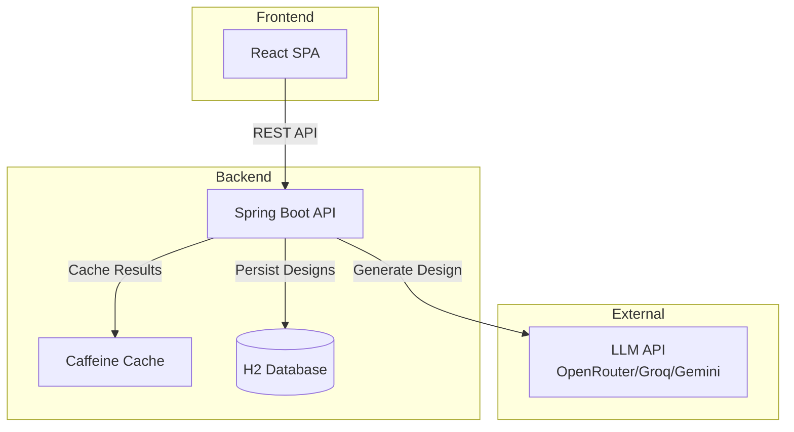
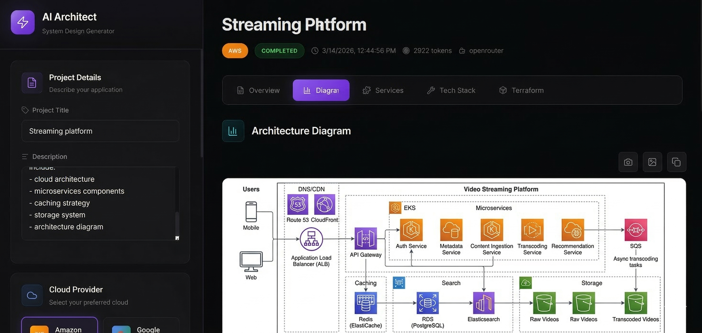

# AI Architect - System Design Generator

An AI-powered system architecture generator that creates comprehensive cloud infrastructure designs from natural language descriptions. Simply describe your application requirements and get complete architecture designs with diagrams, service recommendations, Terraform code, and cost estimates.


---

## Overview

AI Architect is a full-stack application that leverages Large Language Models (LLMs) to automatically generate detailed system architecture designs. Input your project requirements in natural language, select your cloud provider and architecture style, and receive:

- **Architecture Explanation** - Detailed description of the system design
- **Service Components** - Breakdown of services with dependencies
- **Technology Stack** - Recommended technologies for each layer
- **Mermaid Diagrams** - Visual architecture diagrams with cloud service icons
- **Terraform Snippets** - Infrastructure-as-Code ready for deployment
- **Cost Estimates** - Approximate monthly and yearly cost projections
- **Security Recommendations** - Best practices for your architecture

---

## Architecture Overview



## Live


## Features

### Core Features
| Feature | Description |
|---------|-------------|
| **Natural Language Input** | Describe your application requirements in plain English |
| **Multi-Cloud Support** | Generate architectures for AWS, GCP, Azure, or Multi-Cloud |
| **Architecture Styles** | Choose from Monolith, Microservices, or Serverless patterns |
| **Visual Diagrams** | Auto-generated Mermaid architecture diagrams with service icons |
| **Terraform Generation** | Infrastructure-as-Code snippets ready for deployment |
| **Cost Estimation** | Approximate monthly/yearly cost breakdowns |
| **Design History** | Save and retrieve previous architecture designs |

### Technical Features
| Feature | Description |
|---------|-------------|
| **Idempotency** | Identical requests return cached results (saves API costs) |
| **Rate Limiting** | Token bucket algorithm prevents abuse |
| **Caching** | Caffeine-based caching for fast response times |
| **Circuit Breaker** | Resilience4j protection against LLM failures |
| **RESTful API** | Clean API design with pagination and filtering |
| **Admin Controls** | Regenerate, delete, and purge designs |
| **Docker Ready** | Multi-stage Dockerfile for containerized deployment |

### Supported LLM Providers
- OpenRouter (default)
- OpenAI (GPT-3.5, GPT-4)
- Groq (Mixtral)
- Google Gemini
- Any OpenAI-compatible API

---

## Tech Stack

### Backend
| Technology | Version | Purpose |
|------------|---------|---------|
| Java | 21 LTS | Runtime |
| Spring Boot | 3.3.5 | Application Framework |
| Spring Data JPA | 3.3.5 | Database ORM |
| Spring Security | 3.3.5 | Authentication |
| H2 Database | 2.2.x | Embedded Database |
| Caffeine | 3.1.8 | Caching |
| Bucket4j | 8.10.1 | Rate Limiting |
| Resilience4j | 2.2.0 | Circuit Breaker |
| Apache HttpClient | 5.3.1 | HTTP Client |

### Frontend
| Technology | Version | Purpose |
|------------|---------|---------|
| React | 18.2.0 | UI Framework |
| React Router | 6.21.0 | Routing |
| Axios | 1.6.2 | HTTP Client |
| Mermaid | 10.6.1 | Diagram Rendering |
| Lucide React | 0.577.0 | Icons |
| html2canvas | 1.4.1 | Export to PNG |

---

## Prerequisites

- **Java 21** (LTS)
- **Maven 3.8+**
- **Node.js 18+** (for frontend)
- **LLM API Key** (your Personal key or for testing user free key  OpenRouter, Groq, Gemini, or HuggingFace)

## Quick Start

### Step 1: Clone the Repository

```bash
git clone https://github.com/Lalit-Rajpurohit/AI-System-Design-Generator
cd aisystemgen
```

### Step 2: Get an LLM API Key

Get an API key from one of these providers:
- **OpenRouter** (Recommended): https://openrouter.ai/keys
- **Groq** (Free tier): https://console.groq.com/keys
- **OpenAI**: https://platform.openai.com/api-keys

### Step 3: Set Environment Variables

**Windows (PowerShell):**
```powershell
$env:LLM_API_KEY = "your-api-key-here"
$env:LLM_PROVIDER = "openrouter"
$env:LLM_MODEL = "openai/gpt-3.5-turbo"
```

**Windows (Command Prompt):**
```cmd
set LLM_API_KEY=your-api-key-here
set LLM_PROVIDER=openrouter
set LLM_MODEL=openai/gpt-3.5-turbo
```

**Linux/macOS:**
```bash
export LLM_API_KEY=your-api-key-here
export LLM_PROVIDER=openrouter
export LLM_MODEL=openai/gpt-3.5-turbo
```

### Step 4: Run the Backend

```bash
# Using Maven wrapper (recommended)
./mvnw spring-boot:run

# On Windows
mvnw.cmd spring-boot:run

# Or build JAR and run
./mvnw clean package -DskipTests
java -jar target/ai-system-designer-1.0.0-SNAPSHOT.jar
```

The backend API will be available at: **http://localhost:8080**

### Step 5: Run the Frontend

Open a **new terminal** window:

```bash
cd frontend
npm install
npm start
```

The frontend will be available at: **http://localhost:3000**

### Step 6: Open the Application

Open your browser and navigate to:
```
http://localhost:3000
```

You should see the AI Architect interface. Enter your project details and click "Generate Architecture"!

---

## Running with Docker

### Using Docker Compose (Recommended)

```bash
# Set your API key
export LLM_API_KEY=your-api-key-here

# Build and start all services
docker-compose up --build

# Or run in background
docker-compose up -d --build
```

### Using Docker Directly

```bash
# Build the image
docker build -t ai-system-designer .

# Run the container
docker run -p 8080:8080 \
  -e LLM_API_KEY=your-api-key \
  -v $(pwd)/data:/app/data \
  ai-system-designer
```

Access the application at **http://localhost:3000**

## API Endpoints

### Generate Design

```bash
curl -X POST http://localhost:8080/api/v1/generate \
  -H "Content-Type: application/json" \
  -d '{
    "title": "Scalable E-commerce Platform",
    "description": "Design architecture for a scalable e-commerce platform supporting 1M monthly active users, with secure payments, search, and real-time order processing. Prefer AWS, microservices.",
    "preferences": {
      "cloudProvider": "AWS",
      "architectureStyle": "MICROSERVICES",
      "expectedMonthlyActiveUsers": 1000000,
      "dataConsistency": "EVENTUAL",
      "includeTerraform": true,
      "diagramFormat": "MERMAID",
      "includeCostEstimate": true
    }
  }'
```

### Generate Preview (No Persist)

```bash
curl -X POST http://localhost:8080/api/v1/generate-preview \
  -H "Content-Type: application/json" \
  -d '{
    "title": "Quick Preview",
    "description": "Simple URL shortener service"
  }'
```

### Get Design by ID

```bash
curl http://localhost:8080/api/v1/designs/{uuid}
```

### List Designs

```bash
# List all
curl "http://localhost:8080/api/v1/designs?page=0&size=20"

# Filter by status
curl "http://localhost:8080/api/v1/designs?status=COMPLETED"

# Search by title
curl "http://localhost:8080/api/v1/designs?search=ecommerce"
```

### Admin Endpoints

Admin endpoints require the `X-API-KEY` header.

```bash
# Set admin key
export APP_ADMIN_KEY=your-admin-key

# Regenerate a design
curl -X POST http://localhost:8080/api/v1/admin/designs/{uuid}/regenerate \
  -H "X-API-KEY: $APP_ADMIN_KEY"

# Delete a design
curl -X DELETE http://localhost:8080/api/v1/admin/designs/{uuid} \
  -H "X-API-KEY: $APP_ADMIN_KEY"

# Purge old designs
curl -X POST "http://localhost:8080/api/v1/admin/purge?olderThanDays=30" \
  -H "X-API-KEY: $APP_ADMIN_KEY"

# Health check
curl http://localhost:8080/api/v1/admin/health \
  -H "X-API-KEY: $APP_ADMIN_KEY"
```

## Configuration

### Environment Variables

| Variable | Description | Default |
|----------|-------------|---------|
| `LLM_API_KEY` | **Required**. API key for LLM provider | - |
| `LLM_PROVIDER` | LLM provider name | `openrouter` |
| `LLM_URL` | LLM API endpoint | `https://openrouter.ai/api/v1/chat/completions` |
| `LLM_MODEL` | Model identifier | `mistralai/mistral-7b-instruct` |
| `LLM_TIMEOUT_MS` | Request timeout | `20000` |
| `LLM_MAX_TOKENS` | Max tokens to generate | `4096` |
| `APP_ADMIN_KEY` | Admin API key | - |
| `CORS_ALLOWED_ORIGINS` | Allowed CORS origins | `http://localhost:3000` |
| `RATE_LIMIT_RPM` | Requests per minute per IP | `10` |
| `SERVER_PORT` | Server port | `8080` |

### LLM Provider Configuration

#### OpenRouter

```properties
LLM_PROVIDER=openrouter
LLM_URL=https://openrouter.ai/api/v1/chat/completions
LLM_MODEL=mistralai/mistral-7b-instruct
```

#### Groq

```properties
LLM_PROVIDER=groq
LLM_URL=https://api.groq.com/openai/v1/chat/completions
LLM_MODEL=mixtral-8x7b-32768
```

#### Google Gemini

```properties
LLM_PROVIDER=gemini
LLM_URL=https://generativelanguage.googleapis.com/v1beta/models/gemini-pro:generateContent
LLM_MODEL=gemini-pro
```

## Sample Requests

### E-commerce Platform

```json
{
  "title": "Scalable E-commerce Platform",
  "description": "Multi-vendor e-commerce platform with product catalog, shopping cart, secure checkout with multiple payment gateways, order tracking, reviews, and recommendation engine. Should handle 1M MAU with peak traffic during sales events.",
  "preferences": {
    "cloudProvider": "AWS",
    "architectureStyle": "MICROSERVICES",
    "expectedMonthlyActiveUsers": 1000000,
    "includeTerraform": true,
    "includeCostEstimate": true
  }
}
```

### Real-time Chat Application

```json
{
  "title": "Real-time Chat Application",
  "description": "Slack-like team communication platform with channels, direct messages, file sharing, voice/video calls, and mobile apps. Needs to support 100k concurrent connections with sub-second message delivery.",
  "preferences": {
    "cloudProvider": "GCP",
    "architectureStyle": "MICROSERVICES",
    "expectedMonthlyActiveUsers": 500000,
    "dataConsistency": "EVENTUAL",
    "includeTerraform": true
  }
}
```

## Running Tests

```bash
# Run all tests
./mvnw test

# Run specific test class
./mvnw test -Dtest=PromptBuilderTest

# Run with coverage
./mvnw test jacoco:report
```

## Project Structure

```
aisystemgen/
│
├── src/                                    # Backend Source Code
│   ├── main/
│   │   ├── java/com/cloudmonitor/ai/
│   │   │   │
│   │   │   ├── AiSystemDesignerApplication.java    # Main entry point
│   │   │   │
│   │   │   ├── config/                     # Configuration Classes
│   │   │   │   ├── AsyncConfig.java            # Async thread pool configuration
│   │   │   │   ├── CacheConfig.java            # Caffeine cache setup
│   │   │   │   ├── LLMConfig.java              # LLM provider configuration
│   │   │   │   ├── RateLimitConfig.java        # Bucket4j rate limiting
│   │   │   │   └── SecurityConfig.java         # Security & CORS config
│   │   │   │
│   │   │   ├── controller/                 # REST Controllers
│   │   │   │   ├── DesignController.java       # Public API endpoints
│   │   │   │   └── AdminController.java        # Admin operations
│   │   │   │
│   │   │   ├── dto/                        # Data Transfer Objects
│   │   │   │   ├── GenerateRequestDTO.java     # Input request model
│   │   │   │   ├── DesignResponseDTO.java      # Output response model
│   │   │   │   ├── DesignListDTO.java          # Paginated list response
│   │   │   │   ├── LLMRequestDTO.java          # LLM request format
│   │   │   │   └── LLMResponseDTO.java         # LLM response format
│   │   │   │
│   │   │   ├── model/                      # JPA Entities
│   │   │   │   └── DesignEntity.java           # Design database model
│   │   │   │
│   │   │   ├── repository/                 # Data Access Layer
│   │   │   │   └── DesignRepository.java       # JPA repository interface
│   │   │   │
│   │   │   ├── service/                    # Business Logic
│   │   │   │   ├── DesignService.java          # Service interface
│   │   │   │   ├── LLMClient.java              # LLM client interface
│   │   │   │   └── impl/
│   │   │   │       ├── DesignServiceImpl.java      # Service implementation
│   │   │   │       └── OpenRouterLLMClient.java    # LLM client implementation
│   │   │   │
│   │   │   ├── exception/                  # Exception Handling
│   │   │   │   ├── DesignNotFoundException.java
│   │   │   │   ├── LLMException.java
│   │   │   │   └── GlobalExceptionHandler.java
│   │   │   │
│   │   │   ├── scheduler/                  # Scheduled Tasks
│   │   │   │   └── PurgeOldDesignsScheduler.java   # Auto-cleanup old designs
│   │   │   │
│   │   │   └── util/                       # Utilities
│   │   │       └── PromptBuilder.java          # LLM prompt construction
│   │   │
│   │   └── resources/
│   │       └── application.properties          # Application configuration
│   │
│   └── test/                               # Unit Tests
│       └── java/com/cloudmonitor/ai/
│           ├── repository/DesignRepositoryTest.java
│           ├── service/DesignServiceTest.java
│           └── util/PromptBuilderTest.java
│
├── frontend/                               # Frontend Source Code
│   ├── public/
│   │   └── index.html                          # HTML template
│   │
│   ├── src/
│   │   ├── index.js                            # React entry point
│   │   ├── index.css                           # Global styles
│   │   ├── App.js                              # Main layout component
│   │   │
│   │   ├── pages/                          # Page Components
│   │   │   ├── HomePage.js                     # Home with design form
│   │   │   ├── DesignPage.js                   # Individual design view
│   │   │   └── HistoryPage.js                  # Design history list
│   │   │
│   │   ├── components/                     # Reusable Components
│   │   │   ├── DesignForm.js                   # Input form with preferences
│   │   │   ├── DesignResult.js                 # Results display panel
│   │   │   ├── MermaidDiagram.js               # Diagram renderer with icons
│   │   │   └── CloudIcons.js                   # Cloud provider icons
│   │   │
│   │   └── services/                       # API Communication
│   │       └── api.js                          # Axios API client
│   │
│   ├── package.json                            # NPM dependencies
│   └── package-lock.json
│
├── data/                                   # H2 Database files (runtime)
├── logs/                                   # Application logs (runtime)
├── target/                                 # Maven build output (runtime)
│
├── pom.xml                                 # Maven configuration
├── Dockerfile                              # Docker image definition
├── docker-compose.yml                      # Docker Compose configuration
├── postman_collection.json                 # API test collection
├── .github/workflows/ci.yml                # GitHub Actions CI/CD
└── README.md                               # This file
```

### Backend Package Descriptions

| Package | Description |
|---------|-------------|
| `config` | Spring configuration classes for security, caching, rate limiting, and LLM setup |
| `controller` | REST API controllers handling HTTP requests |
| `dto` | Data Transfer Objects for API request/response serialization |
| `model` | JPA entity classes mapped to database tables |
| `repository` | Spring Data JPA repositories for database operations |
| `service` | Business logic layer with interfaces and implementations |
| `exception` | Custom exceptions and global error handling |
| `scheduler` | Scheduled background tasks (e.g., cleanup old designs) |
| `util` | Utility classes for prompt building and helpers |

### Frontend Component Descriptions

| Component | Description |
|-----------|-------------|
| `App.js` | Main layout with sidebar and content area |
| `DesignForm.js` | Input form with project details and preferences |
| `DesignResult.js` | Tabbed display of architecture, services, terraform, etc. |
| `MermaidDiagram.js` | Renders Mermaid diagrams with cloud service icons |
| `CloudIcons.js` | SVG icons for AWS, Azure, GCP services |
| `api.js` | Axios client with interceptors for API calls |

## Security Considerations

- **Never hardcode API keys** - Use environment variables
- **Rate limiting** - Built-in per-IP rate limiting
- **Admin authentication** - API key required for admin endpoints
- **Input validation** - Request validation with size limits
- **CORS** - Configurable allowed origins
- **No auto-apply** - Terraform snippets are for reference only

## Cost Warning

Using LLM APIs incurs costs. Each design generation typically uses 1,000-4,000 tokens. Monitor your API usage and set appropriate rate limits.

## Contributing

1. Fork the repository
2. Create a feature branch
3. Make your changes
4. Run tests: `./mvnw test`
5. Submit a pull request

## License

MIT License - See LICENSE file for details.
